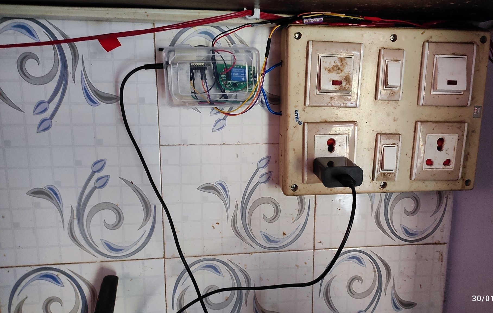
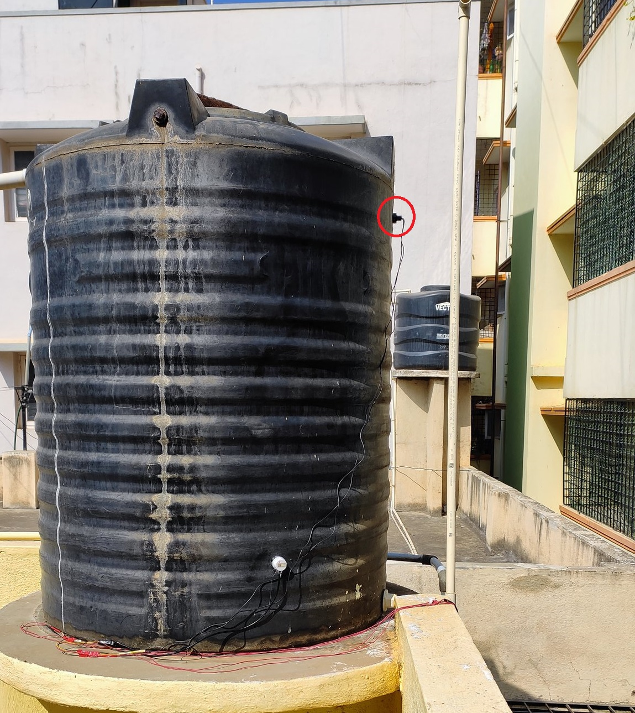
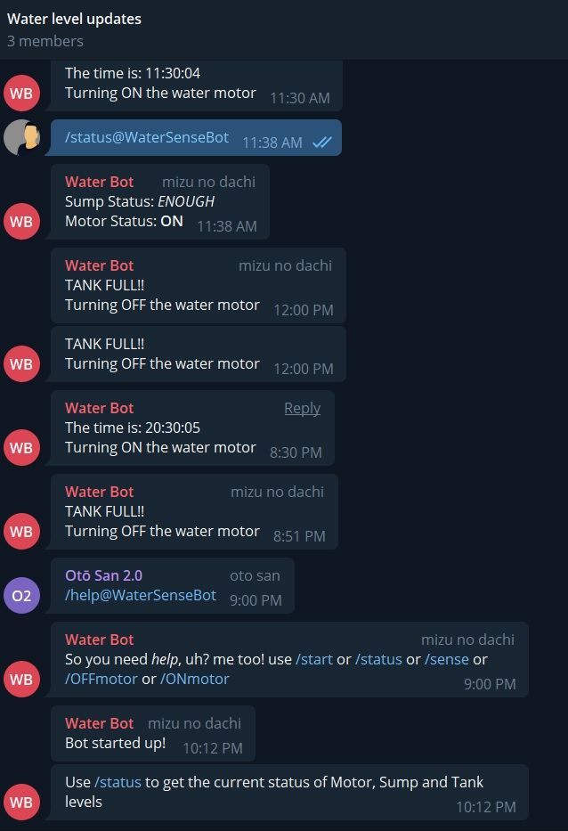
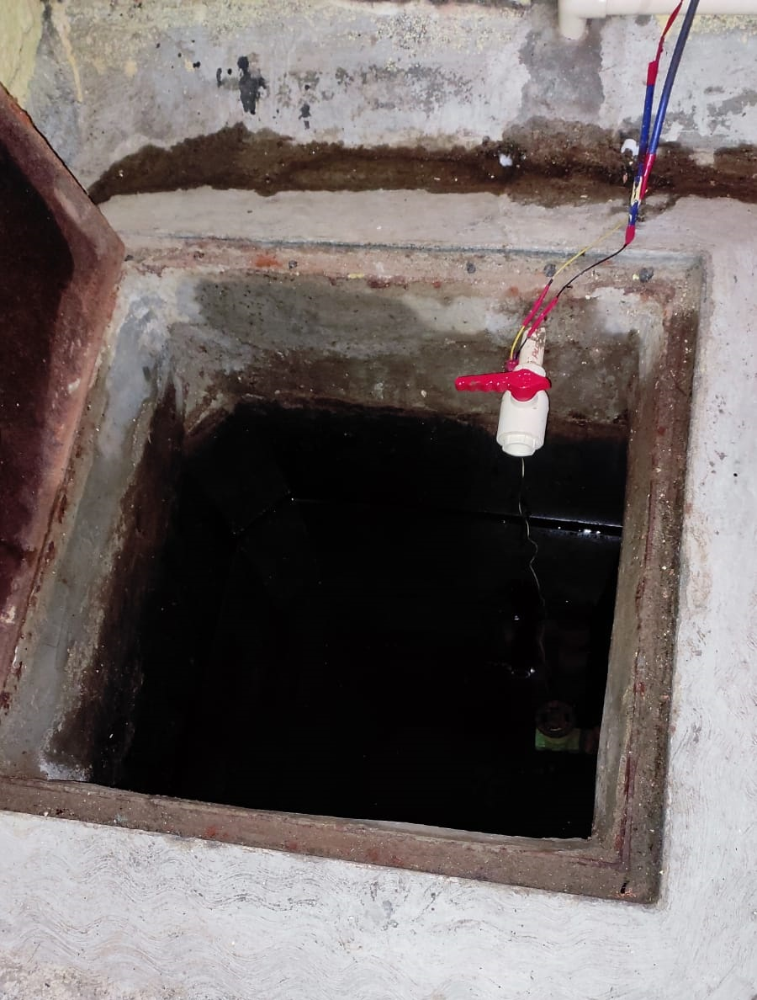

# WaterLevelCheck

This thing can do a whole lotta stuff:
- Notifies water level (via telegram bot):
    - In sump as 'LOW' when the water is lower than vertical switch sensor and 'ENOUGH' otherwise.
    - 'FULL' when water is above horizontal switch sensor.
- Turn ON/OFF the motor based on water levels in sump and tank.
    - When there's low water in sump and no water in tank: it notifies to limit the water usage or get the sump filled.
    - When there's no water in tank and enough water in sump: turns ON the motor and notifies the same.
    - When the tank is full and sump is low: it notifies to get the sump filled asap and doesn't turn on the motor until the water in sump is enough.
- Bot commands:
    1. /help: prints the usable commands that are /start and /status
    2. /start: prints a _hello_ message with the user's name
    3. /status: prints the status of 
        - Sump: LOW/ENOUGH
        - Tank: FULL/LOW
        - Motor: ON/OFF
    4. /sense: prints the current state of each sensor
    5. /ONmotor: makes the relay pin HIGH
    6. /OFFmotor: makes the relay pin LOW

Here's my _artistic_ circuit diagram made with MS paint

>Note: I dont own any of the images except my ✨artistic wiring and drawings✨

# **Final setup**

## Kitchen
<!--  -->

## Tank on terrace
<!--  -->

## Telegram bot
<!--  -->

## Sump setup
<!--  -->

